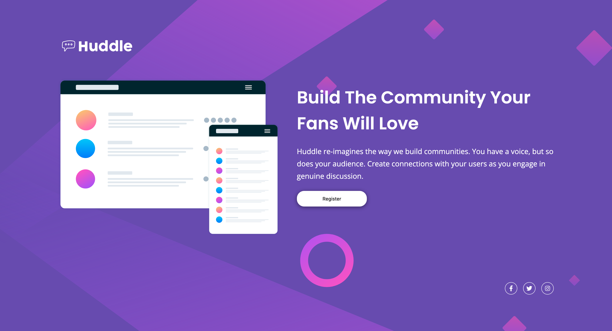

### Links

- Solution URL: [https://www.frontendmentor.io/solutions/huddle-landing-page-hacdBIsDj6](https://www.frontendmentor.io/solutions/huddle-landing-page-hacdBIsDj6)
- Live Site URL: [https://user9511.github.io/frontend-mentor-huddle-landing-page-with-single-introductory-section/](https://user9511.github.io/frontend-mentor-huddle-landing-page-with-single-introductory-section/)

# Frontend Mentor - Huddle landing page with single introductory section solution

This is a solution to the [Huddle landing page with single introductory section challenge on Frontend Mentor](https://www.frontendmentor.io/challenges/huddle-landing-page-with-a-single-introductory-section-B_2Wvxgi0). Frontend Mentor challenges help you improve your coding skills by building realistic projects.

## Table of contents

- [Links](#links)
- [The challenge](#the-challenge)
- [Screenshot](#screenshot)
- [My process](#my-process)
- [Built with](#built-with)
- [Author](#author)

### The challenge

Users should be able to:

- View the optimal layout for the page depending on their device's screen size
- See hover states for all interactive elements on the page

### Screenshot

### Built with

- Semantic HTML5 markup
- CSS custom properties
- Flexbox
- CSS Grid
- Mobile-first workflow

## Author

- Frontend Mentor - [@Smgy94](https://www.frontendmentor.io/profile/Smgy94)
- Twitter - [@ShaneMcGeown94](https://twitter.com/ShaneMcGeown94)
- LinkedIn - [@ShaneMcGeown](https://www.linkedin.com/in/shanemcgeown/)
